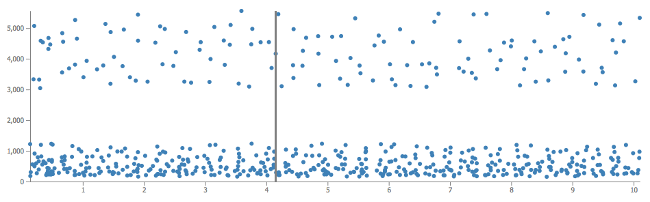

# React + D3 + WebAudio

The user interface of the app is created with `React`. Plots are created from the JSON representation with `D3`. The WebAudio API is used to play the audio corresponding to the visual representation.

The tone cloud data used in the demo are stored in a `Couch` database.

# Audiovisual representation of tone clouds



The above figure shows the representation of a tone cloud (frequency by time).

Tone clouds are often used in psychophysics to study informational masking. It is composed of a lot of short tones with random frequencies and timing. This app can be used to retrieve tone clouds and create a visual and audio representation (a plot and the possibilty to play it). The data describing the tone clouds are in JSON. Here is an example:

```json
{
       "id": "id0.9047746300912152",
       "time": 0.10040397713053295,
       "dur": 0.04,
       "freq": 377.06146240234375,
       "gain": 0
   },
   {
       "id": "id0.9047746300912152",
       "time": 0.10823139121738024,
       "dur": 0.04,
       "freq": 677.8109741210938,
       "gain": 0
   },
   {
       "id": "id0.9047746300912152",
       "time": 0.08324281302117242,
       "dur": 0.04,
       "freq": 3360.919189453125,
       "gain": 0
   },
   {
       "id": "id0.9047746300912152",
       "time": 0.1594112684299276,
       "dur": 0.04,
       "freq": 5049.54931640625,
       "gain": 0
   },
  ...
```
